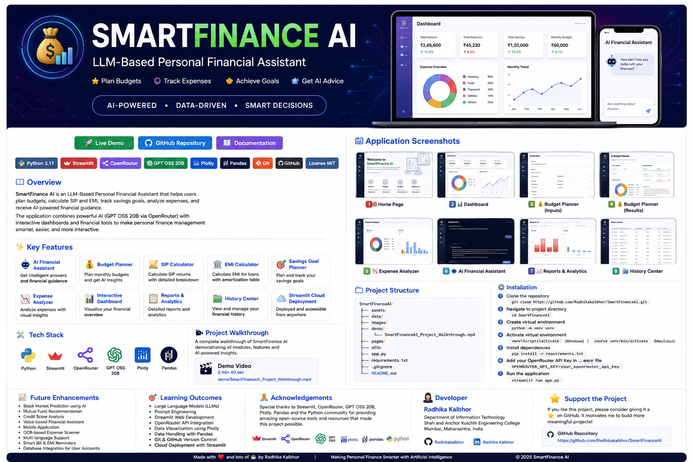
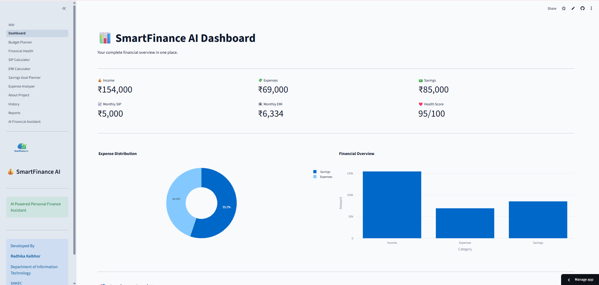
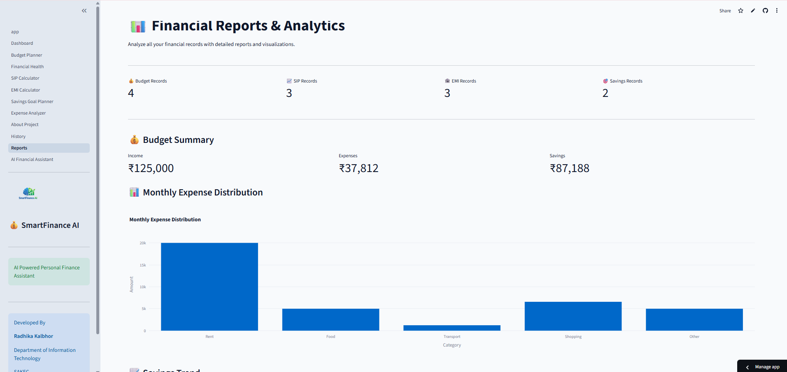
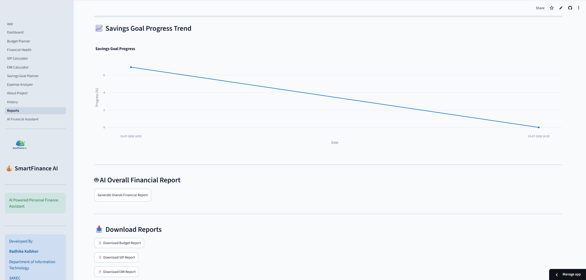

<p align="center">
  
</p>

<h1 align="center">💰 SmartFinance AI</h1>

<h3 align="center">
LLM-Based Personal Financial Assistant
</h3>

### 🤖 LLM-Based Personal Financial Assistant
<p align="center">

<a href="https://smartfinanceai-ashhrgvyglmuvdipappdalt.streamlit.app/">

</a>

<a href="https://github.com/Radhikakalbhor/SmartFinanceAI">

</a>

</p>

<p align="center">


</p>

---

## 🌐 Live Demo

🚀 **Try the Application Here**

**https://smartfinanceai-ashhrgvyglmuvdipappdalt.streamlit.app/**

---

## 💻 GitHub Repository

**https://github.com/Radhikakalbhor/SmartFinanceAI**

---

# 📖 Project Overview

SmartFinance AI is an **LLM-Based Personal Financial Assistant** that helps users plan budgets, calculate SIP and EMI, track savings goals, analyze expenses, and receive AI-powered financial guidance.

The application is built using **Python**, **Streamlit**, **OpenRouter API**, and the **GPT OSS 20B** language model. It combines financial planning tools with conversational AI to make personal finance management more interactive and user-friendly.

The project also includes interactive dashboards, reports, historical data tracking, and visual analytics using Plotly.

---

# ✨ Key Features

- 🤖 AI Financial Assistant
- 💰 Budget Planner
- 📈 SIP Calculator
- 🏦 EMI Calculator
- 🎯 Savings Goal Planner
- 📊 Expense Analyzer
- 📈 Interactive Dashboard
- 📋 Reports & Analytics
- 📂 History Center
- ☁️ Streamlit Cloud Deployment

---

# 🛠️ Technology Stack

| Category | Technology |
|----------|------------|
| Programming Language | Python |
| Framework | Streamlit |
| AI Provider | OpenRouter API |
| LLM | GPT OSS 20B |
| Data Processing | Pandas |
| Visualization | Plotly |
| Version Control | Git & GitHub |
| Deployment | Streamlit Community Cloud |
# 📸 Application Screenshots

---

## 🏠 Home Page


---

## 📊 Dashboard



---

## 💰 Budget Planner


---

## 💰 Budget Planner Results


---

## 🤖 AI Financial Assistant


---

## 🤖 AI Chatbot


---

## 📈 Reports & Analytics



---

## 📈 Financial Reports Dashboard


# 📂 Project Structure

```text
SmartFinanceAI/
│
├── .streamlit/
│   └── config.toml
│
├── assets/
│   ├── logo.png
│   └── style.css
│
├── data/
│   ├── budget_history.csv
│   ├── emi_history.csv
│   ├── savings_history.csv
│   └── sip_history.csv
│
├── pages/
│
├── utils/
│   ├── gemini.py
│   └── history.py
│
├── app.py
├── requirements.txt
├── README.md
└── .gitignore
```

---

# ⚙️ Installation Guide

## 1️⃣ Clone the Repository

```bash
git clone https://github.com/Radhikakalbhor/SmartFinanceAI.git
```

---

## 2️⃣ Open the Project Folder

```bash
cd SmartFinanceAI
```

---

## 3️⃣ Create a Virtual Environment

```bash
python -m venv venv
```

---

## 4️⃣ Activate the Virtual Environment

### Windows

```bash
venv\Scripts\activate
```

### macOS / Linux

```bash
source venv/bin/activate
```

---

## 5️⃣ Install Required Packages

```bash
pip install -r requirements.txt
```

---

## 6️⃣ Create a `.env` File

Create a file named:

```text
.env
```

Add your OpenRouter API key:

```text
OPENROUTER_API_KEY="your_openrouter_api_key"
```

---

## 7️⃣ Run the Application

```bash
streamlit run app.py
```

The application will open in your browser automatically.

---

# 🌐 Live Demo

🚀 https://smartfinanceai-ashhrgvyglmuvdipappdalt.streamlit.app/

---

# 📦 Requirements

- Python 3.10+
- Streamlit
- Pandas
- Plotly
- OpenAI SDK
- python-dotenv
- OpenRouter API Key
# 🚀 Future Enhancements

SmartFinance AI can be further enhanced with the following features:

- 📈 Stock Market Prediction using AI
- 💹 Mutual Fund Recommendation System
- 💳 Credit Score Analysis
- 🎙️ Voice-based Financial Assistant
- 🌍 Multi-language Support
- 📱 Mobile Application
- 🔔 Smart Bill & EMI Reminders
- 📄 OCR-based Expense Scanner
- 📊 Advanced Financial Insights
- ☁️ Database Integration for User Accounts

---

# 🎯 Learning Outcomes

During the development of this project, the following concepts and technologies were explored:

- Large Language Models (LLMs)
- Prompt Engineering
- Streamlit Web Application Development
- OpenRouter API Integration
- Interactive Dashboard Development
- Data Visualization using Plotly
- Data Handling with Pandas
- Version Control using Git & GitHub
- Cloud Deployment using Streamlit Community Cloud

---

# 💡 Project Highlights

✔ AI-Powered Personal Finance Assistant

✔ Real-Time Financial Recommendations

✔ Interactive Financial Dashboard

✔ Budget Planning & Expense Analysis

✔ SIP & EMI Calculators

✔ Savings Goal Planner

✔ Historical Data Tracking

✔ Cloud Deployment

✔ Responsive User Interface

✔ Beginner-Friendly Financial Planning Tool

---

# 👩‍💻 Developer

## Radhika Kalbhor

**Department of Information Technology**

**Shah and Anchor Kutchhi Engineering College**

Mumbai, Maharashtra, India

---

## 📬 Connect With Me

### GitHub

https://github.com/Radhikakalbhor

### LinkedIn

> *(Add your LinkedIn profile URL here.)*

---

# 🙏 Acknowledgements

This project was developed as part of an Artificial Intelligence academic project.

Special thanks to:

- Streamlit
- OpenRouter
- GPT OSS 20B
- Plotly
- Pandas
- Python Community

for providing the open-source technologies that made this project possible.

---

# ⭐ If You Like This Project

If you found this project useful,

⭐ **Please consider giving it a Star on GitHub!**

It helps others discover the project and supports future improvements.

---

# 📄 License

This project is intended for educational and learning purposes.

You are welcome to use, learn from, and modify the code with appropriate attribution.

---

## 🚀 Live Application

### 🌐 https://smartfinanceai-ashhrgvyglmuvdipappdalt.streamlit.app/

---

## 💻 GitHub Repository

### https://github.com/Radhikakalbhor/SmartFinanceAI

---

<div align="center">

## ⭐ Thank You for Visiting ⭐

**SmartFinance AI**

*Making Personal Finance Smarter with Artificial Intelligence.*

</div>

---

---